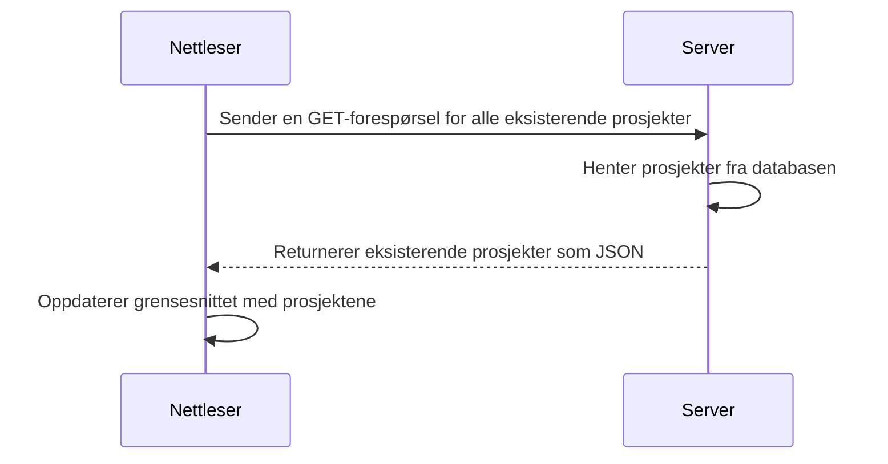

```mermaid
sequenceDiagram
    participant Nettleser
    participant Server

    Nettleser->>Server: Sender en GET-forespørsel for alle eksisterende prosjekter
    Server->>Server: Henter prosjekter fra databasen
    Server-->>Nettleser: Returnerer eksisterende prosjekter som JSON
    Nettleser->>Nettleser: Oppdaterer grensesnittet med prosjektene
```