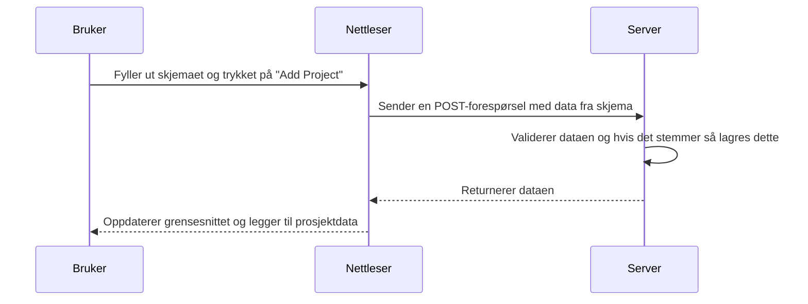

```mermaid
sequenceDiagram
    participant Bruker
    participant Nettleser
    participant Server

    Bruker->>Nettleser: Fyller ut skjemaet og trykket på "Add Project"
    Nettleser->>Server: Sender en POST-forespørsel med data fra skjema
    Server->>Server: Validerer dataen og hvis det stemmer så lagres dette
    Server-->>Nettleser: Returnerer dataen 
    Nettleser-->>Bruker: Oppdaterer grensesnittet og legger til prosjektdata
```